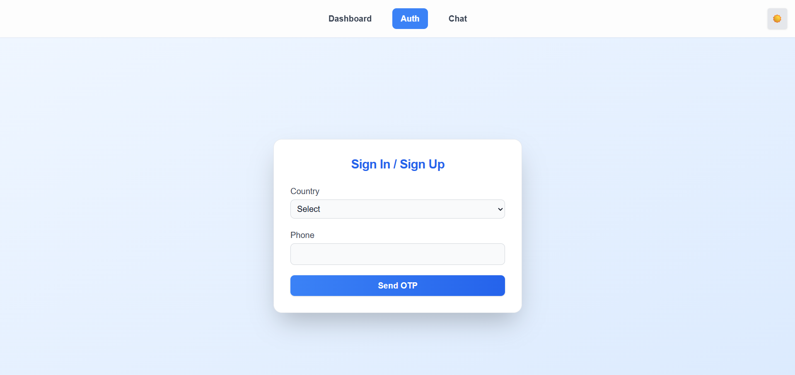
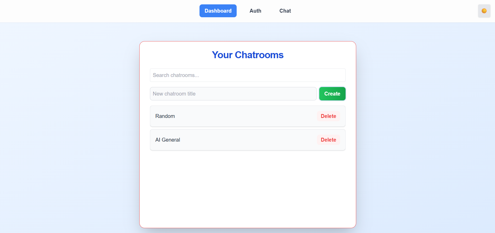
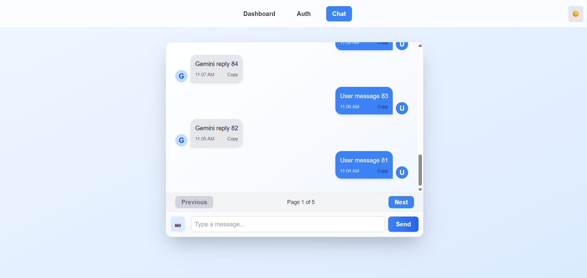
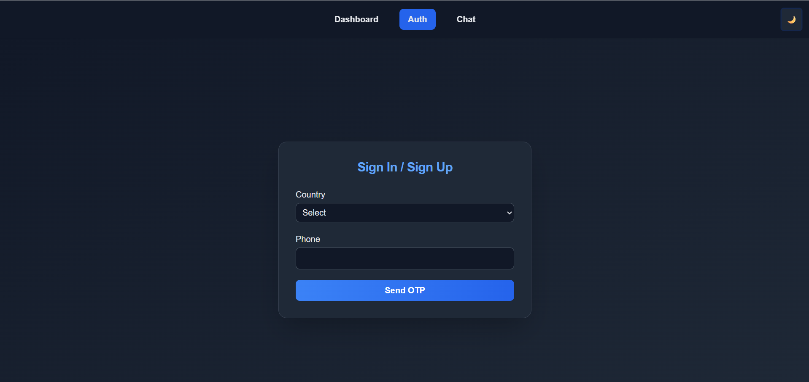

# Gemini Chat Frontend Clone

A modern, responsive chat application inspired by Google Gemini, built with React, Redux Toolkit, and Tailwind CSS.

---

## 🚀 Live Demo

[Live App Link]([cloneegemini.netlify.app](https://cloneegemini.netlify.app/auth)) 

---

## 📖 Project Overview

This project is a frontend clone of the Gemini chat experience. It features:
- Secure phone-based authentication with OTP
- Chatroom creation, search, and deletion
- Real-time-like chat experience with AI-simulated responses
- Dark mode toggle
- Toast notifications for user feedback
- Responsive, mobile-friendly UI

---

## 🛠️ Setup & Run Instructions

1. **Clone the repository:**
   ```bash
   git clone https://github.com/ships97/Gemini-Clone.git
   cd Gemini-Clone
   ```
2. **Install dependencies:**
   ```bash
   npm install
   ```
3. **Start the development server:**
   ```bash
   npm start
   ```
   The app will run at [http://localhost:3000](http://localhost:3000).

4. **Build for production:**
   ```bash
   npm run build
   ```

---

## 📁 Folder & Component Structure

```
my-app/
├── public/                # Static assets
├── src/
│   ├── app/               # Redux store setup
│   ├── components/
│   │   ├── auth/          # AuthForm, OtpInput
│   │   ├── chat/          # ChatRoomList, ChatRoomItem, ChatWindow, MessageInput, MessageItem, ImageUpload
│   │   └── common/        # Header, DarkModeToggle, Toast, SearchBar, SkeletonLoader, CopyToClipboard
│   ├── features/
│   │   ├── auth/          # authSlice (authentication state)
│   │   ├── chat/          # chatSlice (chatrooms/messages state)
│   │   └── ui/            # uiSlice (UI state: dark mode, toasts)
│   ├── hooks/             # Custom hooks (useDebounce, useInfiniteScroll, useLocalStorage)
│   ├── pages/             # Page-level components (AuthPage, DashboardPage, ChatRoomPage)
│   └── utils/             # API utilities, constants
└── ...
```

- **Redux Toolkit** is used for state management (auth, chat, UI).
- **Tailwind CSS** for styling and dark mode.
- **React Router** for navigation.

---

## ⚙️ Key Features & Implementation Details

### 1. Throttling (Debouncing) in Search
- **File:** `src/hooks/useDebounce.js`, `src/components/common/SearchBar.jsx`
- **How:** The `useDebounce` hook delays search API calls until the user stops typing for 300ms, reducing unnecessary requests and improving performance.

### 2. Pagination in Chat
- **File:** `src/components/chat/ChatWindow.jsx`, `src/utils/constants.js`
- **How:** Messages are paginated (`MESSAGES_PER_PAGE = 20`). Users can navigate between pages using Previous/Next buttons. Only messages for the current page are rendered for efficiency.

### 3. Infinite Scroll
- **File:** `src/hooks/useInfiniteScroll.js`
- **How:** The `useInfiniteScroll` hook can be attached to scrollable containers to trigger loading more data when the user scrolls to the top (for chat history, etc.).

### 4. Form Validation
- **File:** `src/components/auth/AuthForm.jsx`
- **How:** Uses `react-hook-form` with `zod` schema validation. Validates country selection and phone number format. OTP step is also validated. Error messages are shown inline.

---

## 🖼️ Screenshots






---

## Credits
- [React](https://reactjs.org/)
- [Redux Toolkit](https://redux-toolkit.js.org/)
- [Tailwind CSS](https://tailwindcss.com/)
- [react-hook-form](https://react-hook-form.com/)
- [zod](https://zod.dev/) 

---

